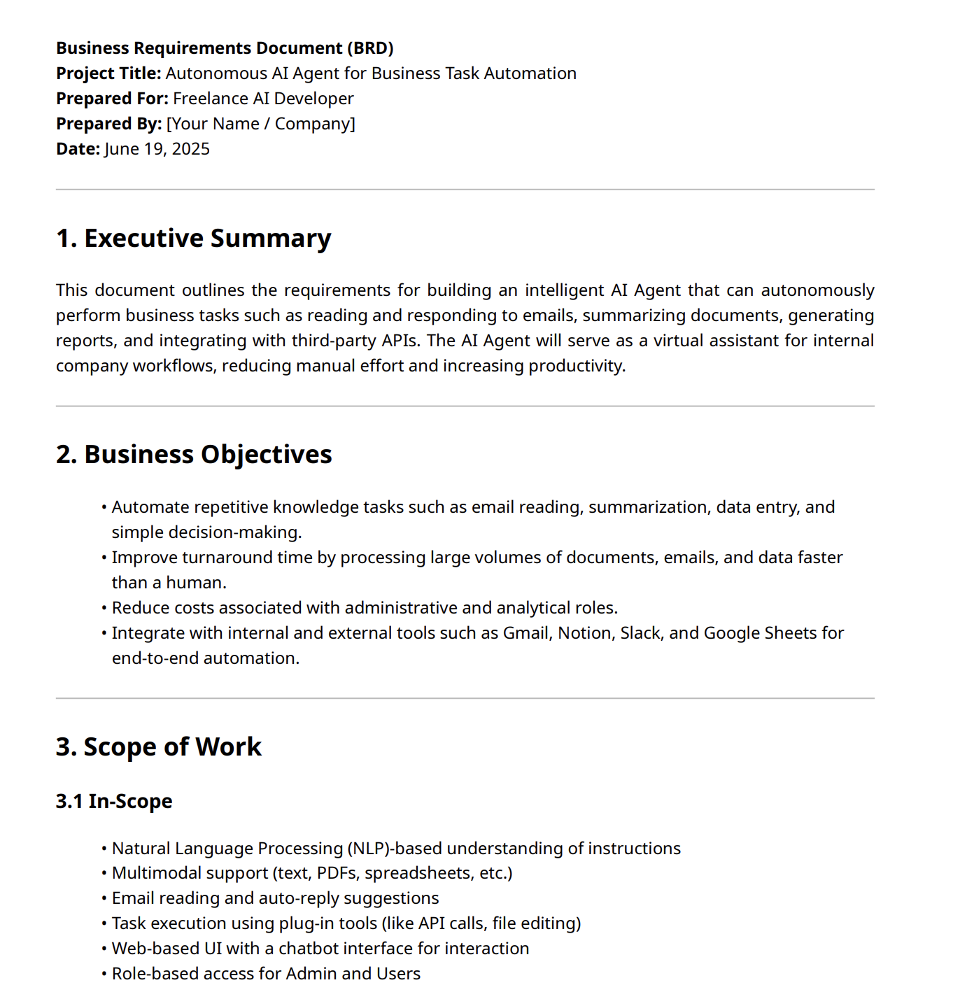

# PDFUI-Agent

A Python library for converting PDF documents to HTML format using AI-powered content analysis.

## Features

- Convert PDF files to HTML
- AI-powered document structure analysis
- Interactive HTML output with collapsible sections
- Search functionality
- Responsive design
- Batch conversion support

## Requirements

- Python 3.7+
- Groq API key

## Installation

Install the required dependencies:

```bash
pip install -r requirements.txt
```

## Setup

1. Create a `.env` file in your project directory
2. Add your Groq API key:

```
GROQ_API_KEY=your_groq_api_key_here

# Optional: Model Configuration
GROQ_MODEL=llama-3.3-70b-versatile

# Optional: Logging Level
LOG_LEVEL=INFO
```

## Usage

### Basic Usage

```python
from pdf_html_converter import PDFToHTMLConverter

# Initialize converter
converter = PDFToHTMLConverter()

# Convert PDF to HTML
html_output = converter.convert_pdf_to_html("data/Ai Agent Business Requirements.pdf")

# Save to file
converter.save_html("output.html", html_output)
```

### Batch Conversion

```python
# Convert multiple PDFs
generated_files = converter.batch_convert(
    pdf_directory="./pdfs/",
    output_directory="./html_output/"
)
```

### Custom Configuration

```python
custom_config = {
    'color_scheme': 'purple-requirements',
    'custom_css': '''
        .custom-highlight {
            background: #ff6b6b;
            padding: 10px;
        }
    '''
}

html_output = converter.convert_with_custom_config(
    pdf_path="data/Ai Agent Business Requirements.pdf",
    config=custom_config
)
```

## Input-Output Examples

The converter generates interactive HTML documents with various features:

- Input:
  
- Custom styled document
  
- Enhanced Output document
  
  

## API Reference

### PDFToHTMLConverter

Main converter class.

#### Methods

- `convert_pdf_to_html(pdf_path, output_path=None)` - Convert single PDF
- `save_html(output_path, html_content)` - Save HTML to file
- `batch_convert(pdf_directory, output_directory)` - Convert multiple PDFs
- `convert_with_custom_config(pdf_path, config)` - Convert with custom settings

## Error Handling

The converter includes error handling for:

- Invalid PDF files
- API failures
- File I/O errors
- Insufficient text content

## Limitations

- Requires Groq API key
- Large PDFs may take longer to process
- Text-based PDFs work best
- Scanned PDFs may have limited accuracy
